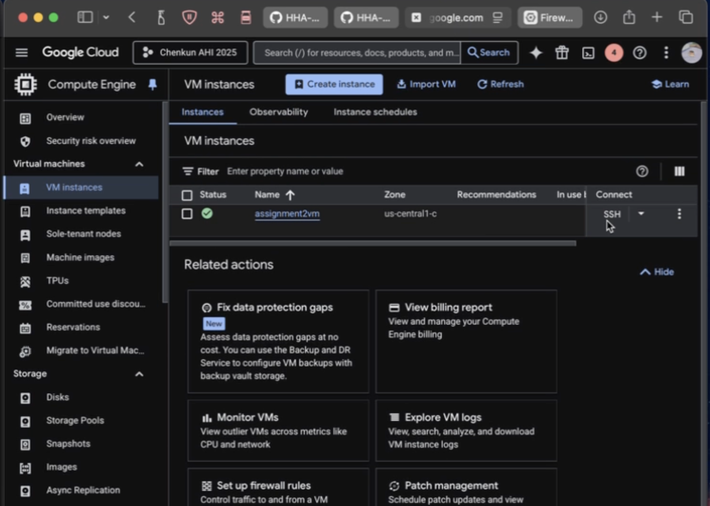
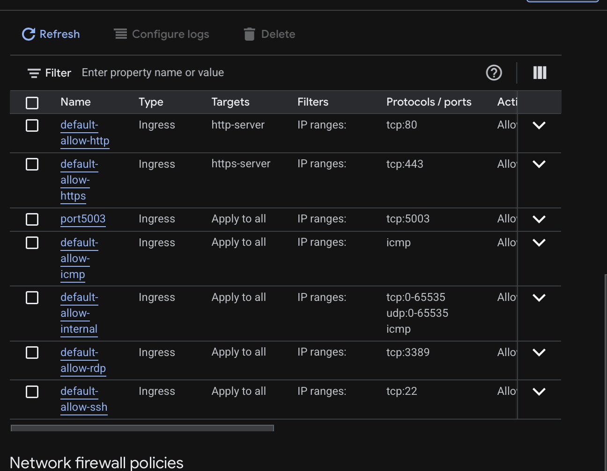

## Student Info
- Name:  Chenkun Xiang
- Cloud Provider:  GCP

## Video recording: 
- Zoom/Loom: [Part 1](https://www.loom.com/share/15fed2bdd6be4e8da86fd0a9c3c5182c), [Part 2](https://www.loom.com/share/1e6d251814ae44eebf2b8d7b7df6bb10), [Part 3](https://www.loom.com/share/2b5b2cb6e5c84796acc4c80328a07207)
- Apologies as Loom is limited to 5 minutes of recording

## Steps
### 1. VM Creation
- Create a VM instance-- in this case GCP-- ensure that it is a micro machine, ubuntu os, and enable http and https activity under firewall

### 2. Networking (Port 5003 Open)
- Create a firewall rule to allow access to Port 5003
- Ingress, Specified protocols and ports and allow all instances, check the tcp and type "5003"

### 3. OS Update + Python Install
- update and installation of the OS as well as git and the virtual environment

### 4. Flask App Running
![screenshot of terminal + browser](browser

### 5. Public IP Access
URL: http://XX.XX.XXX.XXX:5003  
[screenshot]
